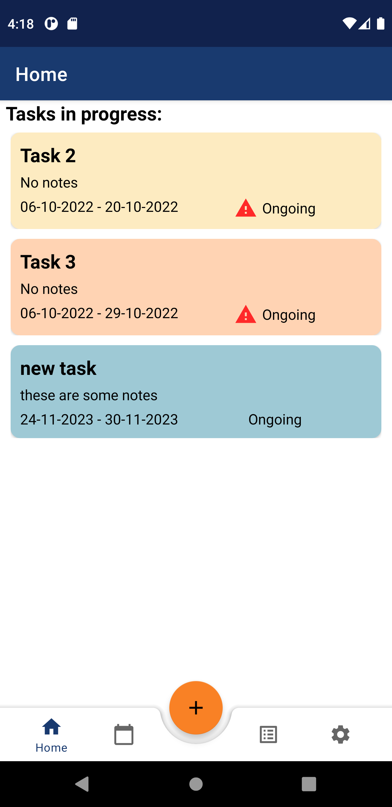

# OVERVIEW
A v ToDo List App for Android.

## Requirements
- Writen in Kotlin
- Create tasks that contain title, notes, start date, compition date and state
- the user must be able to create, edit, delete and add subtasks to those tasks
- Create a database to store and fetch them
- Display the tasks by date, status

## Tools used
- Android Studio IDE
- Room

# Screenshots

  
  
  
  

